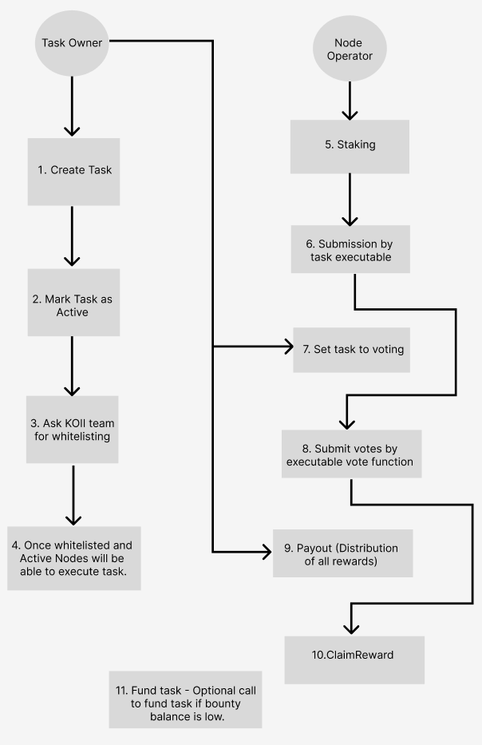

# CREATE TASK CLI

## How to run
You can run the create task cli by using the command `npx @_koii/create-task-cli`

## Overview

  

This utility CLI allows to create tasks on k2 native task contract. Simplifying the process of going through the code to create the tasks. You just need the executable file deployed on arweave and a wallet to fund the task and you should be able to create a task. The functionality of this CLI includes the following:

Before entering the wallet address: There are two options: 
1. **Create a local repository**: Clone the remote template to the local directory
2. **Other operations**: Deploy and other operations

After you enter the wallet address, you can choose from one of the following options. 

1. **Deploy a new task:** As name suggests this option allows you to create new task, once you select this option you will be asked for all necessary inputs required to create a new task.
2. **Set task to voting:** This option allows the task to set task to voting state, The task can have 3 states namely AcceptingSubmissions, AcceptingVotes, Completed.
3. **Whitelist the task:** This option is for KOII only to whitelist the task, once you create a new task it must be whitelisted before it is available for nodes to run.
4. **Mark task as active/ Inactive:** This option allows to mark the task as active or Inactive. By default when a new task is created it is Inactive by default.
5. **Trigger payout:** When the submissions and voting is completed. You can trigger payout. On the basis of the voting/submissions the system will distribute the reward per round to all submissions and voters on the basis of their stake.(The reward won't be distributed but stored in state which can be claimed by voters and submitters)
6. **Claim reward:** The voters and submitters can claim their reward using this option.
7. **Fund task with more KOII:** IF the task is running out of KOII for next rounds this option can be used to fund the task with more KOII.

A KOII task created will be visible to millions of KOII nodes running. They will select to run the task on the basis of the bounty and difficuly (computation requirement of task). Nodes running in Witness mode will only audit the submissions and get a small chunk of bounty and nodes running the full fledge service node will submit the submissions after performing the task and also audit other nodes. Finally, on the basis of staked weighted voting the nodes submitting the correct result will be awarded with bounty and nodes submitting incorrect result will be slashed.

## Steps to create a new task

1. First of all you will need to create a executable (javascript file containing core logic). This executable will be responsible for performing the respective task, submitting the result to the chain (`SubmitTask`) and an audit function responsible for verifying the submissions of other nodes and submitting vote to the chain verifying their submissions (`Vote`). [Example Here](https://github.com/koii-network/k2-node/blob/raj-test/executables/cjnebwkjvbwjkbwvjkvbkbvhvbb.js)

2. Second step would be to upload this executable on the Arweave and in return you will get the tx id which will be point to that js file. You will need this transaction id when creating the task. 
<strong>NOTE:</strong> When running the task-node in development mode, the task-node will try to find the file in executables folder with the same name (tx id) you put when creating the contract. So, you don't have to deploy your file on arweave again and again to test.

3. The third step would be running the test-validator (k2 local testnet). [Refer here](https://github.com/koii-network/k2/blob/dev/README.md#running-a-test-validator)

4. Fourth step would be creating the actual contract instance on the task-contract using the cli as referred on the top (`Create a new task`). Once the task is created you will need to mark the task as active (`Mark task as active`) and whitelist the task (`Whitelist the task`) as referred above. In actual production environment the whitelisting will be done by the KOII team. But currently you will need access to one secret key to whitelist the task (Can be asked by any KOII team member).
 
5. Once you have the task created, you should be able to see your task once you run the task-node. Then you can specify the id of your task in the environment variable or manually select the task in the prompt.

6. Your task should submit the results to the chain.

7. Once submission period is over you can change the task to voting mode (`Set task to voting`) as referred above.

8. Once the task is set to voting the executable which was continuously checking the status of the task will start submitting votes for the other submissions.

9. Once the voting period is over the task owner will trigger the payout. (`Trigger payout`) which will update the balance of the submitter and voters on the basis of the correctness of their submissions and votes.

10. The submitters and voters can call (`Claim reward`) to get the rewarded KOII to their respective wallet addresses.