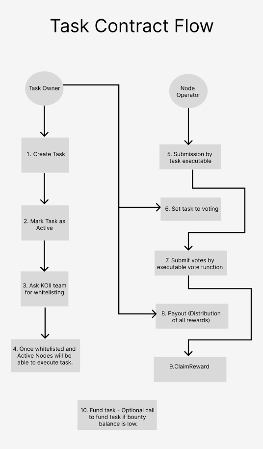

# CREATE TASK CLI

This utility CLI allows to create tasks on k2 native task contract. Simplifying the process of going through the code to create the tasks. You just need the executable file deployed on arweave and a wallet to fund the task and you should be able to create a task. The functionality of this CLI includes the following:

1. **Create a new task:** As name suggests this option allows you to create new task, once you select this option you will be asked for all necessary inputs required to create a new task.
2. **Set task to voting:** This option allows the task to set task to voting state, The task can have 3 states namely AcceptingSubmissions, AcceptingVotes, Completed.
3. **Whitelist the task:** This option is for KOII only to whitelist the task, once you create a new task it must be whitelisted before it is available for nodes to run.
4. **Mark task as active/ Inactive:** This option allows to mark the task as active or Inactive. By default when a new task is created it is Inactive by default.
5. **Trigger payout:** When the submissions and voting is completed. You can trigger payout. On the basis of the voting/submissions the system will distribute the reward per round to all submissions and voters on the basis of their stake.(The reward won't be distributed but stored in state which can be claimed by voters and submitters)
6. **Claim reward:** The voters and submitters can claim their reward using this option.
7. **Fund task with more KOII:** IF the task is running out of KOII for next rounds this option can be used to fund the task with more KOII.